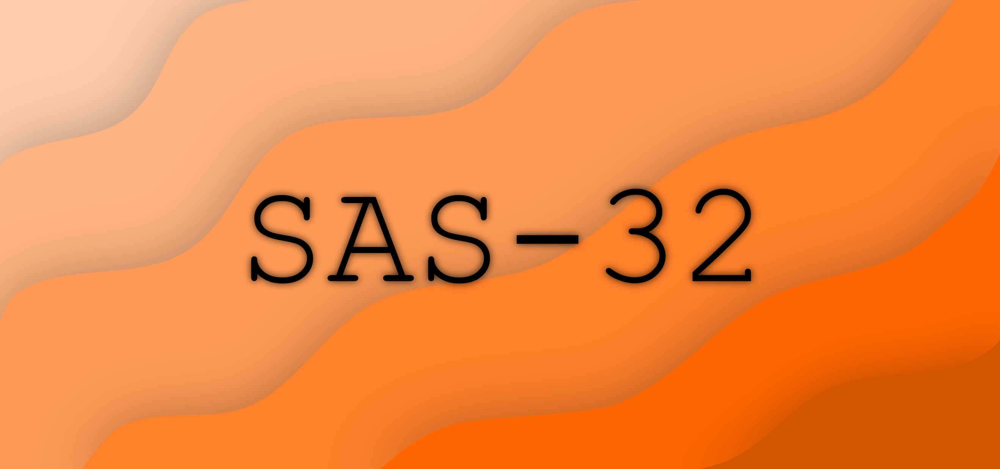

# Abandoned!
This project has been abandoned, you are free to use the specs as you wish :P but the compiler and emulator
are not guarenteed to work.



# SAS (Small and Simple) :smile:
Sas is a cpu architecture that was just created for emulators and other such
stuff. It is for fun and for learning basic assembly language. You can
look at [specs](specs.md) for more information.

## Features :star2:

* 32-bit architecture :pager:
* Easy to use :tada:
* Less than 25 instructions to grasp :page_with_curl:
* Easy to debug :bug:
* Fast and extensible emulator :zap:

## Compiler/Decompiler
The compiler is itself written in nim and the code is organized using modules.
Your main interest should be at module [sas/toolchain/parser](src/sas/toolchain/parser.nim). To
compile a source file. You should follow the following series in order. The
result of one to the other in chain: 

* `parseAsm`
* `resolveIncludeDirectives`
* `compile`

And to decompile you can use the following function

* `decompile`

To convert debuginfo from table to string. There are exported functions that
are originally located in [sas/toolchain/debuginfo](src/sas/toolchain/debuginfo.nim).

* `fromTextDebugInfo`
* `toTextDebugInfo`

## CLI :computer:
This compiler also provides a commandline interface. First, build the main
binary by using `nimble -d:release build`. This should build the sas binary
which you can invoke by `./sas --help`. The CLI interface is full featured.

## Compiler Compilation Flags :crossed_flags:
The compiler has some flags that alter the output binary.

| Flag | Effect |
| ---- | ------ |
| `-d:release` | Makes the compiler very fast :zap: |
| `--mm:orc --deepcopy:on` | Makes the compiler even faster :zap::zap: |
| `-d:hideWarnings` | Resulting compiler will never have any warnings enabled :warning: |

## Running the tests
This project comes with a test suite, any contributions made require a test to be
written, as of now these work by using the tool `testament`. To run these tests
you can run the following command:

```
testament cat .
```

## Specs :ledger:
To basically learn about SAS, please look into [specs](specs.md). They contain
every detail. Even a reference 

# Licensing :page_facing_up:
LICENSED UNDER MIT LICENSE. LOOK AT [LICENSE](LICENSE) FILE FOR MORE DETAILS
